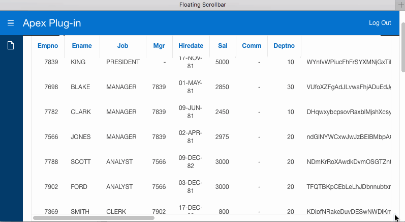

# Oracle APEX Dynamic Action Plugin - Floating Scrollbar
This plugin enables to glue a horizontal scrollbar of a region to the bottom of a page.
In other words, whenever region is visible it's horizontal scrollbar is visible as well.

Plugin is based on Ben Alman's [jQuery Floating Scrollbar](https://gist.github.com/cowboy/846423).

## Preview

## Installation
Import *dynamic_action_plugin_pl_sebastiancichosz_floating-scrollbar.sql* file into your application.

## Usage
1. Create dynamic action for an event of your choice (e.g. Page Load for static region, After Refresh for interactive region).
2. Choose *Floating Scrollbar [Plug-In]* as a true action.
3. Set your region in Affected Elements group.
4. Remember to set Fire on Initialization if it's After Refresh event.
